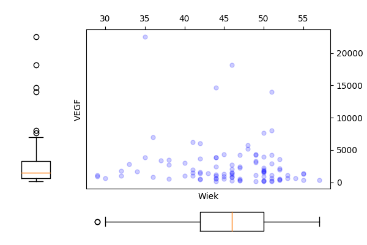

  
```{r setup, include=FALSE}
knitr::opts_chunk$set(cache=TRUE)
```

# R Zadanie 3.1 {.tabset}

Napisz funkcję `momenty()`, która dla zadanego wektora liczb wyznaczy średnią, wariancję, skośność i kurtozę.

## R code

```{r}
momenty <- function(x) {
  require(e1071)
  c(srednia = mean(x), wariancja = var(x), skosnosc = skewness(x), kurtoza = kurtosis(x))
}

momenty(rnorm(20))
```

## Python code

```{r engine='python',engine.path='python3',python.reticulate=FALSE}
import scipy.stats as stats
import numpy as np
import pandas as pd

def momenty(x):
    mu = np.mean(x)
    var = np.var(x,ddof=1)
    sk = stats.skew(x)
    ku = stats.kurtosis(x)
    return pd.DataFrame({'średnia' :[mu], 'wariancja' :[var],\
                   'skośność':[sk], 'kurtoza':[ku]})

print(momenty(stats.norm.rvs(size=20)))
```

# RR Zadanie 3.2 {.tabset}

Ze zbioru danych `daneO` wyciągnij zmienną `VEGF` i narysuj dla niej histogram (ile podziałów przyjąć?). Co o zmiennej mówi ten histogram? Zastosuj
transformację, która ustabilizuje tą zmienną, a następnie narysuj histogram
dla transformowanych danych. Na histogramie zamiast liczebności zaznacz
prawdopodobieństwa, następnie dorysuj do tego wykresu ocenę gęstości wyznaczoną z użyciem funkcji `density()`.

## R code

```{r}
hist(daneO$VEGF,30)
daneO$noweVEGF = log(daneO$VEGF)
hist(daneO$noweVEGF,30, probability =T)
gest = density(daneO$noweVEGF)
lines(gest$x, gest$y, col="red",lwd=2)
```

## Python code

```{r engine='python',engine.path='python3',python.reticulate=FALSE}
import scipy.stats as stats
import numpy as np
import pandas as pd
import matplotlib.pyplot as plt

daneO = pd.read_csv("http://www.biecek.pl/R/dane/daneO.csv",sep=";",header=0)

fig = plt.figure(figsize=(14,6))
ax1 = fig.add_subplot(1,2,1)
ax2 = fig.add_subplot(1,2,2)
ax1.hist(daneO['VEGF'],bins=30)
N,bins,patches = ax2.hist(np.log(daneO['VEGF']),bins=30,density=True)
X = np.linspace(np.min(bins), np.max(bins), 100)
density = stats.gaussian_kde(np.log(daneO['VEGF']))
ax2.plot(X,density(X),color='red',linewidth=2)
plt.tight_layout()
plt.savefig('z32.png')
```
```{r z32, echo=FALSE, fig.pos= 'h', fig.show='hold', fig.align='center', fig.cap="Wykresy.", out.width = '100%'}

```

# R Zadanie 3.3 {.tabset}

W zbiorze danych `daneO` znajduje się zmienna liczbowa Wiek i czynnikowa `Receptory.estrogenowe`. Narysuj wykres pudełkowy dla zmiennej `Wiek`
w rozbiciu na zmienną `Receptory.estrogenowe`. Narysuj wykres skrzypcowy dla zmiennej `Wiek` w rozbiciu na poziomy zmiennej `Niepowodzenia`.

## R code

```{r,warning=FALSE,message=FALSE}
boxplot(daneO$Wiek~daneO$Receptory.estrogenowe)
library(vioplot)
with(daneO, vioplot(Wiek[Niepowodzenia=="wznowa"], Wiek[Niepowodzenia!="wznowa"]))
```

## Python code

```{r engine='python',engine.path='python3',python.reticulate=FALSE}
import pandas as pd
import matplotlib.pyplot as plt
import seaborn as sns

daneO = pd.read_csv("http://www.biecek.pl/R/dane/daneO.csv",sep=";",header=0)
daneO = daneO.rename(columns=lambda x: x.replace('.', '_'))

fig = plt.figure(figsize=(14,6))
ax1 = fig.add_subplot(1,2,1)
ax2 = fig.add_subplot(1,2,2)
sns.boxplot(x='Receptory_estrogenowe',y='Wiek',data=daneO, palette="Set2", ax=ax1)
sns.violinplot(x='Niepowodzenia',y='Wiek',data=daneO, palette="Set2",ax=ax2)
plt.tight_layout()
plt.savefig('z33.png')
```
```{r z33, echo=FALSE, fig.pos= 'h', fig.show='hold', fig.align='center', fig.cap="Wykresy.", out.width = '100%'}
knitr::include_graphics("z33.png")
```

# R Zadanie 3.4 {.tabset}

Narysuj wykres rozrzutu dla zmiennych `Wiek` i `VEGF` (bez krzywej regresji
nieparametrycznej). Czy wykres ten zmieni się, jeżeli zmienne będą podane
w innej kolejności? Następnie zmienną `VEGF` narysuj w skali logarytmicznej. Narysuj też wykres rozrzutu dla tych zmiennych w rozbiciu na poziomy
zmiennej `Niepowodzenia`.

## R code

```{r,warning=FALSE,message=FALSE}
attach(daneO)
library(car)
sp(Wiek, VEGF, smooth=F)
sp(VEGF, Wiek, smooth=F)
sp(Wiek, VEGF, smooth=F, log="y")
sp(Wiek,VEGF,groups=Niepowodzenia, smooth=F, log="y")
```

## Python code

```{r engine='python',engine.path='python3',python.reticulate=FALSE,warning=FALSE,message=FALSE }
import pandas as pd
import matplotlib.pyplot as plt

daneO = pd.read_csv("http://www.biecek.pl/R/dane/daneO.csv",sep=";",header=0)
daneO = daneO.rename(columns=lambda x: x.replace('.', '_'))

x = daneO["Wiek"]
y = daneO["VEGF"]

fig = plt.figure(figsize=(6, 4))
grid = plt.GridSpec(4, 4, hspace=0.2, wspace=0.2)
main_ax = fig.add_subplot(grid[:-1, 1:])
y_b = fig.add_subplot(grid[:-1, 0], xticklabels=[], sharey=main_ax)
x_b = fig.add_subplot(grid[-1, 1:], yticklabels=[], sharex=main_ax)

main_ax.plot(x, y, 'ok', markersize=5, alpha=0.2, color="blue")
main_ax.xaxis.tick_top()
main_ax.yaxis.tick_right()
main_ax.set_xlabel('Wiek')
main_ax.set_ylabel('VEGF')
x_b.boxplot(x,vert=False,widths = 0.4)
x_b.axis('off')
y_b.boxplot(y,widths = 0.4)
y_b.axis('off')
fig.subplots_adjust(bottom = 0)
fig.subplots_adjust(left = 0)
plt.savefig('z34a.png')
```
```{r z34a, echo=FALSE, fig.pos= 'h', fig.show='hold', fig.align='center', fig.cap="Wykresy.", out.width = '60%'}

```

```{r engine='python',engine.path='python3',python.reticulate=FALSE,warning=FALSE,message=FALSE }
import pandas as pd
import matplotlib.pyplot as plt

daneO = pd.read_csv("http://www.biecek.pl/R/dane/daneO.csv",sep=";",header=0)
daneO = daneO.rename(columns=lambda x: x.replace('.', '_'))

y = daneO["Wiek"]
x = daneO["VEGF"]

fig = plt.figure(figsize=(6, 4))
grid = plt.GridSpec(4, 4, hspace=0.2, wspace=0.2)
main_ax = fig.add_subplot(grid[:-1, 1:])
y_b = fig.add_subplot(grid[:-1, 0], xticklabels=[], sharey=main_ax)
x_b = fig.add_subplot(grid[-1, 1:], yticklabels=[], sharex=main_ax)

main_ax.plot(x, y, 'ok', markersize=5, alpha=0.2, color="blue")
main_ax.xaxis.tick_top()
main_ax.yaxis.tick_right()
main_ax.set_xlabel('VEGF')
main_ax.set_ylabel('Wiek')
x_b.boxplot(x,vert=False,widths = 0.4)
x_b.axis('off')
y_b.boxplot(y,widths = 0.4)
y_b.axis('off')
fig.subplots_adjust(bottom = 0)
fig.subplots_adjust(left = 0)
plt.savefig('z34b.png')
```
```{r z34b, echo=FALSE, fig.pos= 'h', fig.show='hold', fig.align='center', fig.cap="Wykresy.", out.width = '60%'}
knitr::include_graphics("z34b.png")
```

```{r engine='python',engine.path='python3',python.reticulate=FALSE,warning=FALSE,message=FALSE }
import pandas as pd
import matplotlib.pyplot as plt
import numpy as np

daneO = pd.read_csv("http://www.biecek.pl/R/dane/daneO.csv",sep=";",header=0)
daneO = daneO.rename(columns=lambda x: x.replace('.', '_'))

x = daneO["Wiek"]
y = np.log(daneO["VEGF"])

fig = plt.figure(figsize=(6, 4))
grid = plt.GridSpec(4, 4, hspace=0.2, wspace=0.2)
main_ax = fig.add_subplot(grid[:-1, 1:])
y_b = fig.add_subplot(grid[:-1, 0], xticklabels=[], sharey=main_ax)
x_b = fig.add_subplot(grid[-1, 1:], yticklabels=[], sharex=main_ax)

main_ax.plot(x, y, 'ok', markersize=5, alpha=0.2, color="blue")
main_ax.xaxis.tick_top()
main_ax.yaxis.tick_right()
main_ax.set_xlabel('Wiek')
main_ax.set_ylabel('VEGF')
x_b.boxplot(x,vert=False,widths = 0.4)
x_b.axis('off')
y_b.boxplot(y,widths = 0.4)
y_b.axis('off')
fig.subplots_adjust(bottom = 0)
fig.subplots_adjust(left = 0)
plt.savefig('z34c.png')
```
```{r z34c, echo=FALSE, fig.pos= 'h', fig.show='hold', fig.align='center', fig.cap="Wykresy.", out.width = '60%'}

```

```{r engine='python',engine.path='python3',python.reticulate=FALSE,warning=FALSE,message=FALSE }
import pandas as pd
import matplotlib.pyplot as plt
import numpy as np
import seaborn as sns

daneO = pd.read_csv("http://www.biecek.pl/R/dane/daneO.csv",sep=";",header=0)
daneO = daneO.rename(columns=lambda x: x.replace('.', '_'))
  
plt.figure(figsize=(6, 4))
g = sns.lmplot(x="Wiek", y="VEGF", hue="Niepowodzenia", truncate=True, data=daneO, lowess=False,ci=None)
g.set(yscale='log')
plt.tight_layout()
plt.savefig('z34d.png')
```
```{r z34d, echo=FALSE, fig.pos= 'h', fig.show='hold', fig.align='center', fig.cap="Wykresy.", out.width = '60%'}

```

# R Zadanie 3.5 {.tabset}

Wygeneruj 20 liczb z rozkładu wykładniczego i narysuj dla wygenerowanego
wektora dystrybuantę empiryczną. Następnie zrób to samo dla wektora 200
i 2000 liczb. Używając funkcji `MASS::fitdistr()` oceń parametr `rate` dla
wylosowanego wektora.

## R code

```{r}
x = rexp(20)
plot(ecdf(x))
MASS::fitdistr(x, "exponential")

x = rexp(200)
plot(ecdf(x))

x = rexp(2000)
plot(ecdf(x))
```

## Python code

```{r engine='python',engine.path='python3',python.reticulate=FALSE}
import scipy.stats as stats
import matplotlib.pyplot as plt
from statsmodels.distributions.empirical_distribution import *

fig = plt.figure(figsize=(14,5))
ax1 = fig.add_subplot(1,3,1)
ax2 = fig.add_subplot(1,3,2)
ax3 = fig.add_subplot(1,3,3)
x = stats.expon.rvs(size=20, random_state=2305)
ax1.plot(x,ECDF(x)(x),'.',linewidth=2, color='C1')
fit = stats.expon.fit(x)
ax1.set_title('loc = %.4f, rate = %.4f' % (fit[0],fit[1]))
x = stats.expon.rvs(size=200, random_state=2305)
ax2.plot(x,ECDF(x)(x),'.',linewidth=2, color='C1')
fit = stats.expon.fit(x)
ax2.set_title('loc = %.4f, rate = %.4f' % (fit[0],fit[1]))
x = stats.expon.rvs(size=2000, random_state=2305)
ax3.plot(x,ECDF(x)(x),'.',linewidth=2, color='C1')
fit = stats.expon.fit(x)
ax3.set_title('loc = %.4f, rate = %.4f' % (fit[0],fit[1]))
plt.tight_layout()
plt.savefig('z35.png')
```
```{r z35, echo=FALSE, fig.pos= 'h', fig.show='hold', fig.align='center', fig.cap="Wykresy.", out.width = '100%'}

```


# R Zadanie 3.6 {.tabset}

Używając metod analizy wariancji sprawdź, średnia której ze zmiennych ilościowych w zbiorze danych `daneO` różni się w zależności od poziomu zmiennej Niepowodzenia. Następnie zbuduj wektor zawierający p-wartości dla wyników z wykonanych analiz.

Zmienna `Receptory.progesteronowe` ma wartości na 4 poziomach. Wykonaj dla niej analizę wariancji oraz testy post hoc.

## R code

```{r}
(model1 = summary(lm(Wiek~Niepowodzenia, data = daneO)))
(model2 = summary(lm(Okres.bez.wznowy~Niepowodzenia, data = daneO)))
(model3 = summary(lm(noweVEGF~Niepowodzenia, data = daneO)))
c(Wiek = model1$coef[2,4], Okres.bez.wznowy = model2$coef[2,4], noweVEGF = model3$coef[2,4])

model <- aov(noweVEGF~Receptory.progesteronowe, data = daneO)
TukeyHSD(model)
plot(TukeyHSD(model))
```

## Python code

```{r engine='python',engine.path='python3',python.reticulate=FALSE}
import matplotlib.pyplot as plt
import pandas as pd
import numpy as np
import statsmodels.formula.api as smf
import statsmodels.api as sm
from statsmodels.stats.multicomp import pairwise_tukeyhsd

daneO = pd.read_csv("http://www.biecek.pl/R/dane/daneO.csv",sep=";",header=0)
daneO = daneO.rename(columns=lambda x: x.replace('.', '_'))
daneO['noweVEGF'] = np.log(daneO['VEGF'])
        
model1 = smf.ols('Wiek ~ Niepowodzenia', data=daneO, missing='drop').fit()
model2 = smf.ols('Okres_bez_wznowy ~ Niepowodzenia', data=daneO, missing='drop').fit()
model3 = smf.ols('noweVEGF ~ Niepowodzenia', data=daneO, missing='drop').fit()
print(model1.summary(),'\n',model2.summary(),'\n',model3.summary(),'\n')
print(pd.DataFrame({'Wiek':[model1.pvalues[1]], 'Okres_bez_wznowy':[model2.pvalues[1]], 'noweVEGF':[model3.pvalues[1]] }),'\n')

model = smf.ols('noweVEGF ~ Receptory_progesteronowe', data=daneO, missing='drop').fit()
aov_table = sm.stats.anova_lm(model,typ=2)
print(aov_table,'\n')

df = daneO.dropna()
tukey = pairwise_tukeyhsd(df['noweVEGF'], df['Receptory_progesteronowe'],alpha=0.05)
print(tukey)
  
fig = plt.figure(figsize=(6, 4))
ax1 = fig.add_subplot(1,1,1)
tukey.plot_simultaneous(comparison_name='(+++)',ax=ax1)
plt.tight_layout()
plt.savefig('z36.png')
```
```{r z36, echo=FALSE, fig.pos= 'h', fig.show='hold', fig.align='center', fig.cap="Wykresy.", out.width = '100%'}
knitr::include_graphics("z36.png")
```

# R Zadanie 3.7 {.tabset}

Wykonaj model regresji liniowej dla zmiennych cisnienie.skurczowe i wiek ze zbioru danych `daneSoc`.

## R code

```{r}
daneSoc <- Przewodnik::daneSoc

summary(lm(cisnienie.skurczowe~wiek, data = daneSoc))
```
  
## Python code

```{r engine='python',engine.path='python3',python.reticulate=FALSE}
import pandas as pd
import statsmodels.formula.api as smf

daneSoc = pd.read_csv("http://www.biecek.pl/R/dane/daneSoc.csv", sep=";")
daneSoc = daneSoc.rename(columns=lambda x: x.replace(' ', '_'))
        
print(smf.ols('cisnienie_skurczowe~wiek', data=daneSoc, missing='drop').fit().summary())
```

# R Zadanie 3.8 {.tabset}

Odczytaj ramkę danych z zadania 1.13. Następnie wykonaj model regresji dla
zmiennej `Kreatynina.1`, za zmienne zależne wybierz `Kreatynina.7` i/lub
`Wiek`.

Wyznacz dla tych zmiennych model regresji liniowej, oceń które zmienne są
w istotnej statystycznie zależności, a następnie przedstaw graficznie zależność pomiędzy tymi zmiennymi.

## R code

```{r}
summary(lm(Kreatynina.7~Kreatynina.1+Wiek, data=daneBT))
sp(Kreatynina.7~Kreatynina.1, data=daneBT)
sp(Kreatynina.7~Wiek, data=daneBT)
```

## Python code

```{r engine='python',engine.path='python3',python.reticulate=FALSE}
import pandas as pd
import statsmodels.formula.api as smf
import matplotlib.pyplot as plt
import statsmodels.api as sm
lowess = sm.nonparametric.lowess

daneBT = pd.read_csv("http://www.biecek.pl/R/dane/daneBioTech.csv",sep=';',decimal=',', header=0, encoding='iso8859_2')
daneBT = daneBT.rename(columns=lambda x: x.replace(' ', '_'))

print(smf.ols('Kreatynina_7~Kreatynina_1+Wiek_', data=daneBT, missing='drop').fit().summary())

fig = plt.figure(figsize=(6, 4))
grid = plt.GridSpec(4, 4, hspace=0.2, wspace=0.2)
main_ax = fig.add_subplot(grid[:-1, 1:])
y_b = fig.add_subplot(grid[:-1, 0], xticklabels=[], sharey=main_ax)
x_b = fig.add_subplot(grid[-1, 1:], yticklabels=[], sharex=main_ax)

x = daneBT['Kreatynina_1']; y = daneBT['Kreatynina_7']
w = lowess(y,x, frac=2./3)
main_ax.plot(x, y, 'ok', markersize=5, alpha=0.2, color="blue")
main_ax.plot(w[:,0],w[:,1])
main_ax.xaxis.tick_top()
main_ax.yaxis.tick_right()
main_ax.set_xlabel('Kreatynina_1')
main_ax.set_ylabel('Kreatynina_7')
x_b.boxplot(x,vert=False,widths = 0.4)
x_b.axis('off')
y_b.boxplot(y,widths = 0.4)
y_b.axis('off')
fig.subplots_adjust(bottom = 0)
fig.subplots_adjust(left = 0)
plt.savefig('z38a.png')

fig = plt.figure(figsize=(6, 4))
grid = plt.GridSpec(4, 4, hspace=0.2, wspace=0.2)
main_ax = fig.add_subplot(grid[:-1, 1:])
y_b = fig.add_subplot(grid[:-1, 0], xticklabels=[], sharey=main_ax)
x_b = fig.add_subplot(grid[-1, 1:], yticklabels=[], sharex=main_ax)
  
x = daneBT['Wiek_']; y = daneBT['Kreatynina_7']
w = lowess(y,x, frac=2./3)
main_ax.plot(x, y, 'ok', markersize=5, alpha=0.2, color="blue")
main_ax.plot(w[:,0],w[:,1])
main_ax.xaxis.tick_top()
main_ax.yaxis.tick_right()
main_ax.set_xlabel('Wiek')
main_ax.set_ylabel('Kreatynina_7')
x_b.boxplot(x,vert=False,widths = 0.4)
x_b.axis('off')
y_b.boxplot(y,widths = 0.4)
y_b.axis('off')
fig.subplots_adjust(bottom = 0)
fig.subplots_adjust(left = 0)
plt.savefig('z38b.png')
```
```{r z38a, echo=FALSE, fig.pos= 'h', fig.show='hold', fig.align='center', fig.cap="Wykresy.", out.width = '60%'}
knitr::include_graphics("z38a.png")
```
```{r z38b, echo=FALSE, fig.pos= 'h', fig.show='hold', fig.align='center', fig.cap="Wykresy.", out.width = '60%'}
knitr::include_graphics("z38b.png")
```

# R Zadanie 3.9 {.tabset}

Wykorzystując wybrany test statystyczny sprawdź, która ze zmiennych ilościowych z ramki danych `daneO` ma rozkład istotnie różny od normalnego.

## R code

```{r}
library(nortest)
sf.test(daneO$Wiek)
sf.test(daneO$Okres.bez.wznowy)
sf.test(daneO$VEGF)
```

## Python code

```{r engine='python',engine.path='python3',python.reticulate=FALSE}
import pandas as pd
import scipy.stats as stats

daneO = pd.read_csv("http://www.biecek.pl/R/dane/daneO.csv",sep=";",header=0)
daneO = daneO.rename(columns=lambda x: x.replace('.', '_'))

print(stats.shapiro(daneO['Wiek']))
print(stats.shapiro(daneO['Okres_bez_wznowy'].dropna()))
print(stats.shapiro(daneO['VEGF']))
```

# RR Zadanie 3.10 {.tabset}

Wyznacz moc wybranego testu normalności jako funkcję poziomu istotności dla alternatywy w postaci rozkładu jednostajnego i dla liczebności próby 50.

## R code

```{r}
N = 1000
n = 50
pwart = numeric(N)
for (i in 1:N) {
	pwart[i] = nortest::sf.test(runif(n))$p.value
}   
  
alfy = seq(0,1,0.01)
moce = sapply(alfy, function(x) mean(pwart<x))
plot(alfy, moce, type="l")
```

## Python code

```{r engine='python',engine.path='python3',python.reticulate=FALSE}
import numpy as np
import scipy.stats as stats

N = 1000
n = 50
pwart = [stats.shapiro(stats.uniform.rvs(size=n))[1] for i in range(N) ]
alfy = np.arange(0,1,0.01)
moce = [np.mean(np.less(pwart,[i])) for i in alfy]

import matplotlib.pyplot as plt

fig = plt.figure(figsize=(10,6))
plt.plot(alfy,moce)
plt.xlabel('alfy')
plt.ylabel('moce')
plt.tight_layout()
plt.savefig('R3_10.png')
```
```{r R3_10, echo=FALSE, fig.pos= 'h', fig.show='hold', fig.align='center', fig.cap="Wykresy.", out.width = '80%'}

```

# R Zadanie 3.11 {.tabset}

Sprawdź, które zmienne ilościowe z ramki danych daneO są ze sobą istotnie
statystycznie skorelowane.

## R code

```{r}
cor.test(daneO$Wiek,daneO$Okres.bez.wznowy)
cor.test(daneO$Wiek,daneO$VEGF)
cor.test(daneO$Okres.bez.wznowy,daneO$VEGF)
```

## Python code

```{r engine='python',engine.path='python3',python.reticulate=FALSE}
import pandas as pd
import scipy.stats as stats

daneO = pd.read_csv("http://www.biecek.pl/R/dane/daneO.csv",sep=";",header=0)
daneO = daneO.rename(columns=lambda x: x.replace('.', '_'))
df1 = daneO[['Wiek','Okres_bez_wznowy']].dropna()
df2 = daneO[['Wiek','VEGF']].dropna()
df3 = daneO[['Okres_bez_wznowy','VEGF']].dropna()

print(stats.pearsonr(df1['Wiek'],df1['Okres_bez_wznowy']))
print(stats.pearsonr(df2['Wiek'],df2['VEGF']))
print(stats.pearsonr(df3['Okres_bez_wznowy'],df3['VEGF']))
```

# R Zadanie 3.12 {.tabset}

W zbiorze danych mieszkania podziel zmienną cena na zmienną jakościową opisującą, czy cena jest wyższa od 175000, a zmienną powierzchnia podziel na zmienną jakościową opisującą, czy powierzchnia jest większa od $45m^2$.
Następnie wyznacz poznane współczynniki zgodności dla tych dwóch zmiennych jakościowych.

## R code

```{r}
mieszkania <- Przewodnik::mieszkania
nowaCena = cut(mieszkania$cena, c(0,175000,Inf), c("niska","wysoka"))
nowaPowierzchnia = cut(mieszkania$powierzchnia, c(0,45,Inf), c("mala","duza"))

library(irr)
kappa2(cbind(nowaCena, nowaPowierzchnia))
```

## Python code

```{r engine='python',engine.path='python3',python.reticulate=FALSE}
import pandas as pd
from statsmodels.stats.inter_rater import cohens_kappa
import numpy as np

mieszkania = pd.read_csv("http://www.biecek.pl/R/dane/daneMieszkania.csv",sep=';')
nowaCena = pd.cut(mieszkania['cena'],[0,175000,np.inf],labels=['niska','wysoka'],precision=0)
nowaPowierzchnia = pd.cut(mieszkania['powierzchnia'],[0,45,np.inf],labels=['mala','duza'],precision=0)
print(cohens_kappa(pd.crosstab(index=nowaCena, columns=nowaPowierzchnia)))
```

# RR Zadanie 3.13 {.tabset}

Napisz funkcję, która dla danego wektora liczb (zakładamy, że są to liczby dodatnie) sprawdza, czy po zastosowaniu transformacji logarytmicznej,
odwrotnej lub pierwiastkowej dane nie są "bardziej normalne". Jako wynik
funkcja przekazuje wektor danych przekształconych albo nie (tak by uzyskać
wektor najbardziej zbliżony do rozkładu normalnego) oraz informację, czy
i jaką transformację zastosowano. Do badania odległości do rozkładu normalnego wykorzystać można odległość pomiędzy dystrybuantami. Uwaga:
porównujemy z rodziną rozkładów normalnych a nie jednym rozkładem!

## R code

```{r}
inteligentnaTransformacja <- function(x) {
  require(nortest)
  wynik = list(D = lillie.test(x)$statistic, trans="bez zmian", x = x)
  nx = log(x)
  if (lillie.test(nx)$statistic < wynik$D) {
     wynik = list(D = lillie.test(nx)$statistic, trans="log", x = nx)
  }
  nx = sqrt(x)
  if (lillie.test(nx)$statistic < wynik$D) {
     wynik = list(D = lillie.test(nx)$statistic, trans="sqrt", x = nx)
  }
  nx = 1/x
  if (lillie.test(nx)$statistic < wynik$D) {
     wynik = list(D = lillie.test(nx)$statistic, trans="ivers", x = nx)
  }
  wynik
}

inteligentnaTransformacja(rnorm(100,5))
inteligentnaTransformacja(1/rnorm(100,5))
inteligentnaTransformacja(rnorm(100,5)^2)
inteligentnaTransformacja(exp(rnorm(100,5)))
```

## Python code

```{r engine='python',engine.path='python3',python.reticulate=FALSE}
import scipy.stats as stats
import numpy as np

def inteligentnaTransformacja(x):
    if  stats.anderson(np.log(np.array(x)))[0] < stats.anderson(np.array(x))[0]: \
        return { "statystyka": stats.anderson(np.log(np.array(x)))[0],\
                 "log": np.log(np.arange(x)) }
    elif stats.anderson(np.sqrt(np.array(x)))[0] < stats.anderson(np.array(x))[0]: \
        return { "statystyka": stats.anderson(np.sqrt(np.array(x)))[0],\
                 "sqrt": np.sqrt(np.arange(x)) }
    elif stats.anderson(1/(np.array(x)))[0] < stats.anderson(np.array(x))[0]: \
        return { "statystyka": stats.anderson(1/(np.array(x)))[0],\
                  "ivers": 1/(np.arange(x)) }
    else:
        return { "statystyka": stats.anderson(np.array(x))[0],\
                 "bez zmian": x }
```

# R Zadanie 3.14 {.tabset}

W zbiorze danych `daneO` zmienna Receptory.estrogenowe występuje na
4 poziomach, odpowiednio (-), (+), (++), (+++). Wykonaj analizę wariancji dla następujących funkcji kontrastów: porównujący pacjentki bez tych receptorów (grupa (-)) z pozostałymi grupami, porównujący pacjentki z brakiem lub słabą ekspresją tych receptorów (grupy (-) i (+)) z pozostałymi
grupami, porównujący pacjentki z bardzo wysoką ekspresją (grupa (+++))
z pozostałymi grupami. Uwaga: te kontrasty nie muszą być ortogonalne.

## R code

```{r}
(kontr = cbind(c(3, -1, -1, -1), c(1, 1, -1, -1), c(1, 1, 1, -3)))
summary(lm(noweVEGF~Receptory.estrogenowe, data=daneO, contrasts= list(Receptory.estrogenowe=kontr)))
```

## Python code

```{r engine='python',engine.path='python3',python.reticulate=FALSE}
import pandas as pd
import statsmodels.formula.api as smf
import numpy as np

daneO = pd.read_csv("http://www.biecek.pl/R/dane/daneO.csv",sep=";",header=0)
daneO = daneO.rename(columns=lambda x: x.replace('.', '_'))
daneO['noweVEGF'] = np.log(daneO['VEGF'])

contrast = [[3,1,1], [-1,1,1],[-1,-1,1],[-1,-1,-3]]
model = smf.ols("noweVEGF ~ C(Receptory_estrogenowe, contrast)", data=daneO).fit()
print(model.summary())
```
  
# R Zadanie 3.15 {.tabset}

Sprawdź, czy w zbiorze danych `daneO` zmienne `Płeć` i `WIT` wpływają na cechę
`Kreatynina.7` w sposób addytywny, poprzez interakcję, czy też nie wpływają
w żaden sposób. Zilustruj te zależności graficznie.

## R code

```{r}
summary(lm(daneBT[,7]~daneBT[,2]+daneBT[,3]))
summary(lm(daneBT[,7]~daneBT[,2]*daneBT[,3]))
summary(lm(daneBT[,7]~daneBT[,2]:daneBT[,3]))

interaction.plot(daneBT[,3], daneBT[,2], daneBT[,7])
```

## Python code

```{r engine='python',engine.path='python3',python.reticulate=FALSE}
import pandas as pd
import statsmodels.formula.api as smf

daneBT = pd.read_csv("http://www.biecek.pl/R/dane/daneBioTech.csv",sep=';',decimal=',', header=0, encoding='iso8859_2')
daneBT = daneBT.rename(columns=lambda x: x.replace(' ', '_'))
daneBT.columns = daneBT.columns.str.replace('Płeć_K-0_M-1', 'Płeć')

print(smf.ols('Kreatynina_7~C(Płeć)+C(WIT)', data=daneBT, missing='drop').fit().summary())
print(smf.ols('Kreatynina_7~C(Płeć)*C(WIT)', data=daneBT, missing='drop').fit().summary())
print(smf.ols('Kreatynina_7~C(Płeć):C(WIT)', data=daneBT, missing='drop').fit().summary())


```

# RRR Zadanie 3.16 {.tabset}

W celu testowania równości średnich w dwóch grupach zaimplementuj następującą dwustopniową procedurę.W pierwszym kroku sprawdź, czy w grupach zmienne mają rozkład normalny. Jeżeli tak, to porównaj zmienne testem t-Studenta, jeżeli nie, to porównaj testem Wilcoxona. Zbadaj na kilku
przykładach, czy ta procedura kontroluje błąd pierwszego rodzaju oraz jaką
ma moc w porównaniu do testów t-Studenta i Wilcoxona.

## R code

```
bezpiecznyTest <- function(x1, x2, alpha) {
  require(nortest)
  pwart = sf.test(c(scale(x1),scale(x2)))$p.value
  if (pwart<alpha) {
   return(wilcox.test(x1,x2))
  } 
  t.test(x1,x2)
}

# blad pierwszego rodzaju

N = 100000
n = 10
alfa = 0.1
pwart = numeric(N)
for (i in 1:N) {
	pwart[i] = bezpiecznyTest(rchisq(n,2), rchisq(n,2), alfa)$p.value
}
mean(pwart<alfa)

# moc brak normalnosci

N = 10000
n = 10
alfa = 0.1
pwart1 = pwart2 = pwart3 = numeric(N)
for (i in 1:N) {
	x1 = rchisq(n,2)
	x2 = rchisq(n,2)+1
	pwart1[i] = bezpiecznyTest(x1,x2, alfa)$p.value
	pwart2[i] = t.test(x1,x2)$p.value
	pwart3[i] = wilcox.test(x1,x2)$p.value
}
mean(pwart1<alfa)
mean(pwart2<alfa)
mean(pwart3<alfa)

# moc, rozklady normalne

N = 10000
n = 20
alfa = 0.1
pwart1 = pwart2 = pwart3 = numeric(N)
for (i in 1:N) {
	x1 = rnorm(n,2)
	x2 = rnorm(n,2)+0.7
	pwart1[i] = bezpiecznyTest(x1,x2, alfa)$p.value
	pwart2[i] = t.test(x1,x2)$p.value
	pwart3[i] = wilcox.test(x1,x2)$p.value
}
mean(pwart1<alfa)
mean(pwart2<alfa)
mean(pwart3<alfa)
```

## Python code

```{r engine='python',engine.path='python3',python.reticulate=FALSE}

```